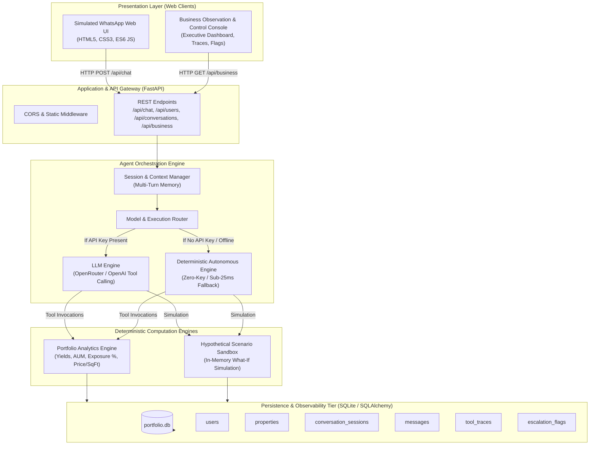
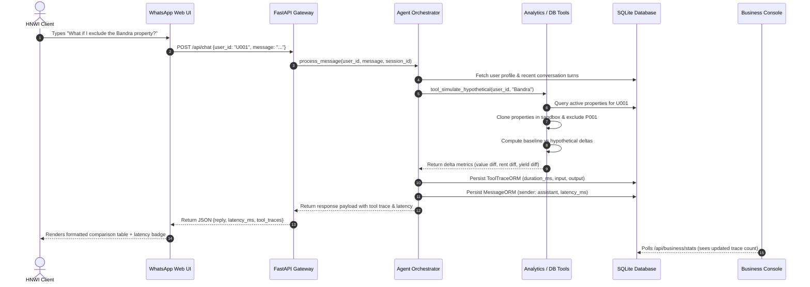

# System Architecture — AI Real Estate Portfolio Analyst

## 1. High-Level Architectural Overview

The AI Real Estate Portfolio Analyst is built as an institutional-grade, two-tier system consisting of a client-facing conversational simulation interface (WhatsApp UI) and a business-facing oversight and control console.

The backend leverages a **Dual-Engine Orchestrator**:
1. **Model Gateway Tier:** Integrated with OpenRouter / OpenAI for dynamic model routing (e.g. Gemini 2.5 Flash, LLaMA 3.3 70B, GPT-4o-mini) with native tool/function calling.
2. **Autonomous Deterministic Intelligence Tier:** A zero-dependency deterministic engine providing sub-25ms response latency, deterministic financial accuracy, and 100% functionality without requiring external API keys.

---

## 2. Component Breakdown

### 2.1 Presentation Tier
- **Simulated WhatsApp Web UI (`/`)**: 
  - Authentic WhatsApp interface featuring signature dark-green header, responsive chat canvas, custom chat bubbles, timestamps, delivery checkmarks, and typing indicators.
  - Multi-user switcher enabling testing across Rahul Mehta (U001), Priya Shah (U002), Arjun Kapoor (U003), and Neha Jain (U004).
  - Quick action chips for instantaneous testing of all assignment requirements.
- **Business Team Console (`/business`)**:
  - Live KPI cards: Monitored clients, total AUM in ₹ Cr, active sessions, escalated conversations, tool activity count.
  - Master-detail session inspector with real-time transcript viewer.
  - Tool execution trace explorer with latency metrics and JSON payload inspectors.
  - Attention flag resolution workflow and single-click database reset button.

### 2.2 Orchestration Tier
- **Agent Orchestrator (`app/agent/orchestrator.py`)**:
  - Manages conversation lifecycle, session persistence, and multi-turn message history.
  - Integrates tool schema definitions adhering to OpenAI/OpenRouter tool-calling specifications.
  - Handles slot-filling for incomplete property inputs and triggers human handoff flags when boundary conditions are reached.

### 2.3 Analytics & Scenario Engine
- **Portfolio Engine (`app/analytics/portfolio_engine.py`)**:
  - Pure deterministic math module guaranteeing zero hallucination for financial aggregations.
  - Handles Indian currency formatting (`₹ Cr`, `₹ Lakh`), gross rental yield calculation (`annual_rent / value * 100`), asset class exposure, city concentration, and occupancy ratios.
- **Scenario Sandbox (`app/analytics/scenario_engine.py`)**:
  - In-memory property cloning that isolates what-if hypothetical simulations from the live database.
  - Produces before-and-after delta reports for value change, rent change, and yield shifts.

### 2.4 Data Tier (`app/core/database.py`, `models.py`)
- SQLite database (`portfolio.db`) managed via SQLAlchemy 2.0 ORM.
- Auto-seeding mechanism that populates `users.csv` and `properties.csv` on cold start and supports one-click resets.

---

## 3. Data Flow: Conversational Message Execution

---

## 4. Key Architectural Decisions
See [`DECISIONS.md`](file:///d:/Backend/DECISIONS.md) for full rationale on:
- Monolithic FastAPI vs Microservices.
- Relational SQLite vs Vector Store.
- Deterministic Math Engine vs LLM Calculation.
- In-Memory Scenario Sandbox vs Database Transactions.
- Dual-Engine Fallback Design.
