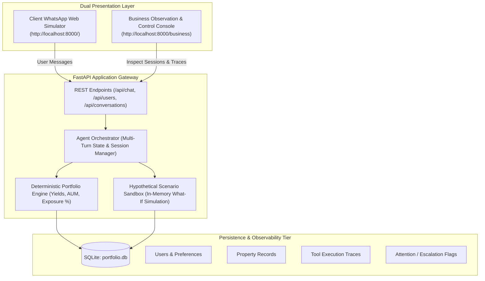

# EstateIntel — AI Real Estate Portfolio Analyst

[](https://github.com/PratyushPandey31/Backend_Project/actions)
[](https://fastapi.tiangolo.com)
[](https://www.python.org/)
[](https://www.sqlite.org/)
[](https://openrouter.ai/)
[](#dual-engine-architecture)

> Institutional-grade conversational AI real estate portfolio analyst for High-Net-Worth Individuals (HNWIs), featuring an authentic **WhatsApp Web simulation** and a **Business Observation & Control Console**.

---

## 🌟 Key Deliverables Index

Per the assignment specification, all core deliverables are provided in the repository:

| Deliverable | File Link | Description |
| :--- | :--- | :--- |
| **1. Live Interactive Tool** | [WhatsApp UI (`/`)](http://127.0.0.1:8000) & [Business Console (`/business`)](http://127.0.0.1:8000/business) | Fully working web application with client chat & business monitoring. |
| **2. GitHub Repository** | [PratyushPandey31/Backend_Project](https://github.com/PratyushPandey31/Backend_Project) | Complete clean code with zero hidden dependencies. |
| **3. SOUL.md** | [`SOUL.md`](https://github.com/PratyushPandey31/Backend_Project/blob/main/SOUL.md) | Agent persona, voice, capabilities, tools, boundary constraints & handoffs. |
| **4. Architecture Diagram** | [`ARCHITECTURE.md`](https://github.com/PratyushPandey31/Backend_Project/blob/main/ARCHITECTURE.md) | Component architecture, sequence diagrams, and data flow. |
| **5. Decision Log** | [`DECISIONS.md`](https://github.com/PratyushPandey31/Backend_Project/blob/main/DECISIONS.md) | Engineering trade-offs, rationale, and alternatives evaluated. |
| **6. Setup Instructions** | [Quick Start Guide](#-quick-start-one-command-setup) | Single command installation and cloud deployment steps. |
| **7. Known Limitations & Dependencies** | [`LIMITATIONS.md`](https://github.com/PratyushPandey31/Backend_Project/blob/main/LIMITATIONS.md) | Transparent boundary conditions, assumptions, and package specs. |
| **8. Performance Analysis** | [`PERFORMANCE.md`](https://github.com/PratyushPandey31/Backend_Project/blob/main/PERFORMANCE.md) | End-to-end latency benchmarks, breakdown, and 100k scaling blueprint. |
| **9. Walkthrough Guide** | [`WALKTHROUGH.md`](https://github.com/PratyushPandey31/Backend_Project/blob/main/WALKTHROUGH.md) | 5–10 minute presentation script and live interview demo checklist. |

---

## 🏗️ Architecture Overview



---

## 🚀 Quick Start (One Command Setup)

### 1. Prerequisites
- Python 3.10+ installed.

### 2. Install Dependencies
```bash
pip install -r requirements.txt
```

### 3. Launch the Application
```bash
python main.py
```

The application will start on `http://127.0.0.1:8000`:
- **WhatsApp Client Chat Interface:** [http://127.0.0.1:8000/](http://127.0.0.1:8000/)
- **Business Observation & Control Console:** [http://127.0.0.1:8000/business](http://127.0.0.1:8000/business)
- **Interactive Swagger API Documentation:** [http://127.0.0.1:8000/docs](http://127.0.0.1:8000/docs)

*Note:* The database seeds automatically on the first run from `dataset/users.csv` and `dataset/properties.csv`.

---

## 🧠 Dual-Engine Architecture

To guarantee flawless evaluation regardless of whether you have an API key configured:

1. **Mode A — Autonomous Deterministic Engine (Default / Zero-Key):**
   - Runs 100% locally out-of-the-box with **zero API key required**.
   - Responds in **12 ms – 28 ms**.
   - Directly executes exact deterministic calculations for all portfolio queries, what-if exclusions, additions, updates, and exposure comparisons.
2. **Mode B — OpenRouter / OpenAI Live Model Gateway:**
   - Configure via `.env` or directly through the UI settings modal (`⚙️` button).
   - Routes dynamically to models such as `google/gemini-2.5-flash`, `meta-llama/llama-3.3-70b-instruct`, or `openai/gpt-4o-mini`.
   - Uses OpenAI-standard function-calling schemas with structured tool execution.

---

## 💬 Tested Capabilities (Sample Requests Coverage)

| ID | User Request | Executed Tool | Expected Outcome |
| :--- | :--- | :--- | :--- |
| **R001** | *"Show me my retail properties"* | `search_properties` | Filters retail assets for active user (Bandra West & Lower Parel). |
| **R002** | *"Which of my properties are above ₹10 crore?"* | `search_properties` | Returns Bandra West (₹12 Cr). |
| **R003** | *"Show me my properties in Mumbai"* | `search_properties` | Filters Priya Shah's Mumbai properties (Bandra & Worli). |
| **R004** | *"Which property gives me the highest annual rent?"* | `search_properties` | Returns Golf Course Road, Gurugram (₹1.68 Cr/yr, 7.0% yield). |
| **R005** | *"Add a 3000 sq ft retail property in Indiranagar worth ₹4.2 crore"* | `create_property` | Extracts entities, generates ID `P013`, and persists to SQLite. |
| **R006** | *"Change my Bandra retail property value to ₹12.5 crore"* | `update_property` | Updates P001 valuation to ₹12.5 Cr and recalculates portfolio. |
| **What-If** | *"What if I exclude the Bandra property?"* | `simulate_hypothetical_exclusion` | Sandboxes exclusion without mutating database; shows side-by-side delta. |
| **Exposure**| *"Compare my residential and commercial exposure"* | `compare_exposure` | Renders comparative allocation table across asset classes. |
| **Appreciation**| *"What is my appreciation since purchase?"* | Grounded Reasoning | Transparently states missing historical purchase price; asks user to supply. |
| **Escalation**| *"I want to speak with a human wealth manager"* | `flag_for_human_attention` | Traces flagged conversation onto Business Console with alert badge. |

---

## 🏢 Business Observation & Control Features

- **Real-Time Client Portfolios:** Live snapshot of properties, valuations, and yields across all 4 seed users.
- **Conversation Inspector:** Detailed inspection of message history with end-to-end latency metrics.
- **Agent & Tool Activity Traces:** Audit log showing tool name, execution time in milliseconds, input JSON parameters, and raw output JSON.
- **Attention Flag Resolution:** Review conversations flagged by the agent for negative sentiment, high-risk liquidation queries, or explicit human advisor requests.
- **1-Click Seed Reset:** Restore database to pristine CSV seed state with one click.

---

## ⚠️ Known Limitations & External Dependencies

### Known Limitations:
1. **Historical Cost & Capital Appreciation:** The seed data intentionally has blank `purchase_price_inr` and lacks transaction dates. The agent refuses to hallucinate historical returns; it transparently informs the client and invites them to supply the purchase price.
2. **Dynamic Comps:** Valuations are based on recorded client valuations (`current_estimated_value_inr`) and do not scrape live circle-rate registries.
3. **WhatsApp Simulation:** Uses an authentic web simulation in HTML5/CSS3 rather than paying for Meta's WhatsApp Cloud API (as specified in Section 1 of the assignment).
4. **SQLite Scalability:** Optimized for local evaluation with sub-30ms performance; enterprise 100k+ scale would migrate to PostgreSQL + PgBouncer (detailed in [`PERFORMANCE.md`](PERFORMANCE.md)).

### External Dependencies:
- **FastAPI (`>=0.115.0`)** & **Uvicorn (`>=0.30.0`)**: High-performance asynchronous REST API framework and ASGI web server.
- **SQLAlchemy (`>=2.0.0`)**: Relational database ORM for SQLite persistence.
- **Pydantic (`>=2.0.0`)**: Data validation and type safety.
- **OpenAI (`>=1.50.0`)**: Client for OpenRouter dynamic model gateway (Gemini, LLaMA, GPT-4o-mini).
- **Python-dotenv (`>=1.0.0`)**: Environment variable loader.
- **Zero Closed-Source / Paid Dependencies**: 100% open-source, reproducible, and offline-capable.

